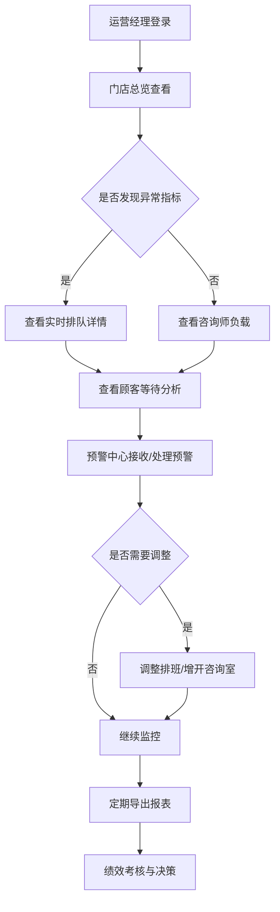

## 1. 产品概述
连锁医美机构咨询师接诊排队数据看板系统，面向运营经理提供门店效率监控与决策支持工具，将传统排队叫号屏升级为数据驱动的运营管理中枢。
- 核心目标：解决门店接诊效率低下、顾客等待时间过长、咨询师负载不均等运营痛点
- 目标用户：连锁医美机构区域运营经理、门店店长
- 市场价值：通过数据化监控降低顾客流失率15%以上，提升咨询师人均产能20%

## 2. 核心功能

### 2.1 用户角色
| 角色 | 登录方式 | 核心权限 |
|------|----------|----------|
| 区域运营经理 | 账号密码登录 | 查看所有门店数据、导出报表、设置预警阈值 |
| 门店店长 | 账号密码登录 | 查看本店数据、处理预警、调整排班 |

### 2.2 功能模块
1. **门店总览**：多门店关键指标对比卡、门店状态热力图、核心KPI趋势
2. **实时排队**：按项目类型分列的排队队列、叫号控制、等待时长标签
3. **咨询师负载**：咨询师接诊状态面板、接诊节奏时间轴、日服务人次统计
4. **顾客等待分析**：高峰时段分布图、新老客等待对比、取消记录追踪
5. **预警中心**：三类预警（超时等待/长时间占用/频繁改派）、预警处理记录
6. **导出报表**：门店效率排行榜、咨询师接诊效率表、自定义时间范围导出

### 2.3 页面详情
| 页面名称 | 模块名称 | 功能描述 |
|-----------|-------------|---------------------|
| 门店总览 | KPI指标卡 | 候诊人数、最长等待、空闲咨询师、今日接诊量四大核心指标，支持门店切换 |
| 门店总览 | 门店列表 | 多门店横向对比表格，支持按区域/指标排序筛选 |
| 门店总览 | 趋势图表 | 今日关键指标24小时折线趋势图 |
| 实时排队 | 项目队列 | 玻尿酸/光电/皮肤管理/手术咨询四类队列卡片，显示排队人数及等待时长 |
| 实时排队 | 排队详情 | 顾客姓名、预约项目、等待时长、状态标签（正常/预警/超时） |
| 实时排队 | 叫号控制 | 下一位、呼叫、改派操作按钮，与排队系统联动 |
| 咨询师负载 | 咨询师卡片 | 头像、姓名、状态（接诊中/空闲/休息）、当前顾客、已服务人次、平均接诊时长 |
| 咨询师负载 | 接诊时间轴 | 当日每位咨询师的接诊时间节点可视化，显示空挡与占用分布 |
| 咨询师负载 | 负载热力图 | 颜色编码显示各时段咨询师忙闲程度 |
| 顾客等待分析 | 高峰时段图 | 按小时柱状图展示候诊人数高峰时段 |
| 顾客等待分析 | 新老客对比 | 分组柱状图对比新客/老客平均等待时长、等待人数占比 |
| 顾客等待分析 | 取消记录表 | 因等待取消的顾客列表，包含取消时间、等待时长、项目类型 |
| 预警中心 | 预警列表 | 按严重程度分级显示（红色紧急/橙色警告/蓝色提示），三类预警分类标签 |
| 预警中心 | 预警详情 | 预警类型、触发时间、关联门店/咨询师/顾客、建议处理方案 |
| 预警中心 | 处理操作 | 标记已处理、添加备注、转派处理人 |
| 导出报表 | 报表选择器 | 门店排行榜/咨询师效率表/综合运营报表三类选择 |
| 导出报表 | 时间筛选 | 自定义日期范围、快捷选项（今日/本周/本月/上月） |
| 导出报表 | 预览与导出 | 在线预览报表内容，支持Excel/PDF格式导出 |

## 3. 核心流程
运营经理登录系统后，首先查看门店总览了解整体运营状态。若发现某门店指标异常，点击进入查看实时排队与咨询师负载情况，判断是否需要增开咨询室或调整排班。预警中心会主动推送超时等待等异常事件，运营经理可直接处理或转派门店店长。定期通过导出报表功能生成周/月运营分析报告，用于管理层决策与咨询师绩效考核。

## 4. 用户界面设计

### 4.1 设计风格
- **主色调**：医疗蓝 `#2563EB`（专业、可信）+ 辅助玫瑰金 `#E8B4B8`（医美行业特性）
- **状态色**：成功绿 `#10B981`、警告橙 `#F59E0B`、危险红 `#EF4444`、信息蓝 `#3B82F6`
- **背景色系**：渐变深蓝底色 `#0F172A → #1E293B`，卡片采用半透明白色玻璃态
- **按钮风格**：圆角12px，主按钮带微光阴影效果，悬停时有微缩放动效
- **字体方案**：标题使用思源黑体 Bold，正文使用思源黑体 Regular，数字使用等宽字体 JetBrains Mono
- **布局风格**：左右分栏导航 + 卡片式内容区，采用网格对齐与留白呼吸感
- **图标风格**：统一使用线性图标，关键数据点使用微渐变数据图形

### 4.2 页面设计概述
| 页面名称 | 模块名称 | UI元素 |
|-----------|-------------|-------------|
| 门店总览 | KPI指标卡 | 玻璃态卡片 + 渐变图标 + 实时数字滚动动画 + 环比小箭头 |
| 门店总览 | 门店列表 | 斑马纹表格 + 状态徽标 + 数据条可视化 + 排序箭头 |
| 门店总览 | 趋势图表 | 渐变填充面积图 + 双Y轴对比 + 鼠标悬停Tooltip |
| 实时排队 | 项目队列 | 四色分列卡片（玻尿酸紫/光电蓝/皮肤绿/手术橙）+ 脉冲动画 |
| 实时排队 | 排队详情 | 头像首字母 + 状态标签（正常灰/警告橙/超时红）+ 等待时长倒计时 |
| 实时排队 | 叫号控制 | 主按钮发光效果 + 声波动画 + 操作确认弹窗 |
| 咨询师负载 | 咨询师卡片 | 在线状态点 + 进度条（接诊进度）+ 悬浮展开详情 |
| 咨询师负载 | 接诊时间轴 | 横向时间轴 + 色块节点 + 缩放控制 + 拖拽平移 |
| 咨询师负载 | 负载热力图 | 7x24网格 + 5级色阶 + 单元格Tooltip详情 |
| 顾客等待分析 | 高峰时段图 | 渐变柱状图 + 高峰警戒线 + 点击下钻时段详情 |
| 顾客等待分析 | 新老客对比 | 分组对比柱 + 差值连线标注 + 百分比标签 |
| 顾客等待分析 | 取消记录表 | 可展开行 + 取消原因标签 + 联系顾客按钮 |
| 预警中心 | 预警列表 | 三级严重度色条 + 闪烁动画（未处理）+ 批量操作栏 |
| 预警中心 | 预警详情 | 左右分栏 + 时间线 + AI建议卡片 + 快捷处理按钮 |
| 预警中心 | 处理操作 | 模态对话框 + 表单自动填充 + 处理结果确认 |
| 导出报表 | 报表选择器 | 卡片式选择 + 悬停上浮效果 + 已选高亮边框 |
| 导出报表 | 时间筛选 | 日期范围选择器 + 快捷按钮组 + 预设模板下拉 |
| 导出报表 | 预览与导出 | 虚拟滚动表格 + 导出进度条 + 文件下载动画 |

### 4.3 响应式设计
- **桌面优先**：基础设计基于1920px宽屏，核心内容区最小宽度1280px
- **平板适配**：1024px-1440px区间，侧边栏可折叠收起为图标模式
- **数据可视化自适应**：图表采用SVG矢量渲染，容器宽度变化时自动重绘
- **表格响应式**：小屏幕下表格支持横向滚动，关键列固定显示
- **触控优化**：操作按钮最小44x44px触控区域，列表项支持左右滑动快捷操作

### 4.4 交互动效设计
- **页面切换**：路由切换采用淡入 + 轻微位移效果（150ms缓动）
- **数字动画**：KPI数字变化采用countUp滚动动画（800ms完成）
- **加载状态**：骨架屏 + 渐变闪烁占位，数据加载完成后平滑过渡
- **预警推送**：新预警从右侧滑入 + 轻微震动反馈 + 数字徽章跳动
- **图表交互**：悬停数据点放大高亮，相邻区域联动高亮
