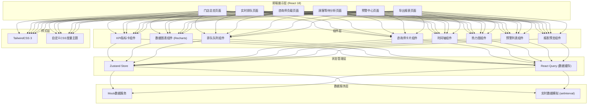
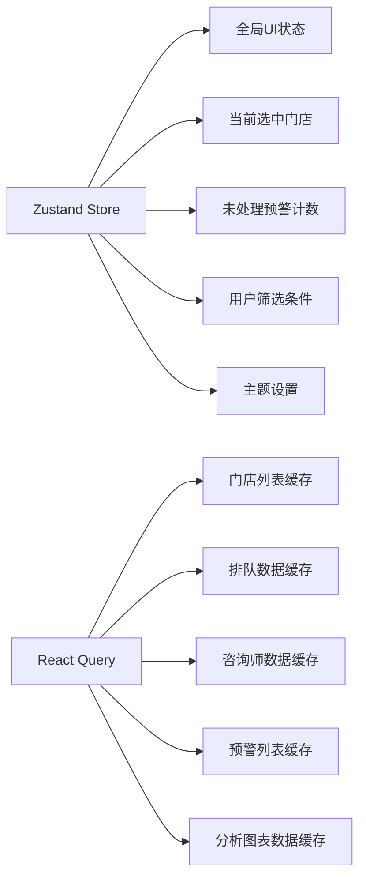

## 1. 架构设计



## 2. 技术说明

- **前端框架**：React 18 + TypeScript 5，采用函数组件 + Hooks范式
- **构建工具**：Vite 5，启用HMR热更新与生产环境代码分割
- **UI样式**：TailwindCSS 3.4 + 自定义CSS变量主题系统，支持暗色模式
- **路由方案**：React Router 6，采用嵌套路由 + 代码分割懒加载
- **状态管理**：Zustand 4 管理全局状态（门店切换、预警计数、用户信息）
- **数据请求**：React Query (TanStack Query) 管理服务端状态，自动缓存与重试
- **图表可视化**：Recharts 2，原生React实现的SVG图表库，支持自定义tooltip
- **图标库**：Lucide React，统一线性图标风格
- **数据方案**：前端Mock数据（TypeScript接口定义 + Mock Service Worker模拟），通过setInterval实现30秒自动刷新模拟实时数据

## 3. 路由定义

| 路由路径 | 页面名称 | 加载方式 |
|-------|---------|----------|
| `/` | 重定向到门店总览 | `<Navigate>` |
| `/overview` | 门店总览 | React.lazy懒加载 |
| `/queue` | 实时排队 | React.lazy懒加载 |
| `/consultant` | 咨询师负载 | React.lazy懒加载 |
| `/waiting` | 顾客等待分析 | React.lazy懒加载 |
| `/alert` | 预警中心 | React.lazy懒加载 |
| `/export` | 导出报表 | React.lazy懒加载 |

## 4. 数据类型定义

```typescript
// 门店信息
interface Store {
  id: string;
  name: string;
  city: string;
  address: string;
  currentWaiting: number;
  maxWaiting: number;
  longestWaitMinutes: number;
  freeConsultants: number;
  totalConsultants: number;
  todayConsultations: number;
  status: 'normal' | 'warning' | 'critical';
}

// 排队项目类型
type ProjectType = 'hyaluronic' | 'photoelectric' | 'skincare' | 'surgery';

// 排队顾客
interface QueuingCustomer {
  id: string;
  name: string;
  avatarInitial: string;
  projectType: ProjectType;
  projectName: string;
  isNewCustomer: boolean;
  appointmentTime: string;
  arrivalTime: string;
  waitMinutes: number;
  status: 'normal' | 'warning' | 'timeout';
  assignedConsultantId?: string;
}

// 咨询师
interface Consultant {
  id: string;
  name: string;
  avatarInitial: string;
  status: 'consulting' | 'free' | 'break';
  currentCustomerName?: string;
  currentProject?: string;
  currentProgress: number; // 0-100
  todayServed: number;
  avgConsultMinutes: number;
  todaySchedule: TimeSlot[];
}

// 时间段
interface TimeSlot {
  start: string;
  end: string;
  type: 'consult' | 'free' | 'break';
  customerName?: string;
}

// 预警
interface Alert {
  id: string;
  type: 'timeout_wait' | 'long_occupation' | 'frequent_reassign';
  severity: 'critical' | 'warning' | 'info';
  storeId: string;
  storeName: string;
  consultantId?: string;
  consultantName?: string;
  customerId?: string;
  customerName?: string;
  message: string;
  triggeredAt: string;
  isHandled: boolean;
  handledBy?: string;
  handledAt?: string;
  handleNote?: string;
  suggestion: string;
}

// 等待分析数据
interface WaitingAnalysis {
  hour: number;
  avgWaitMinutes: number;
  peakCount: number;
  newCustomerCount: number;
  oldCustomerCount: number;
  newCustomerAvgWait: number;
  oldCustomerAvgWait: number;
}

// 取消记录
interface CancelRecord {
  id: string;
  customerName: string;
  phone: string;
  projectType: ProjectType;
  waitMinutes: number;
  cancelTime: string;
  cancelReason: string;
  isNewCustomer: boolean;
}

// 报表数据
interface StoreRanking {
  rank: number;
  storeId: string;
  storeName: string;
  totalConsultations: number;
  avgWaitMinutes: number;
  cancelRate: number;
  efficiencyScore: number;
}

interface ConsultantEfficiency {
  rank: number;
  consultantId: string;
  consultantName: string;
  storeName: string;
  servedCount: number;
  avgConsultMinutes: number;
  customerSatisfaction: number;
  efficiencyScore: number;
}
```

## 5. 状态管理设计



**Zustand Store 划分**：
- `useUIStore`：侧边栏展开状态、全局Loading、Toast消息
- `useStoreSelector`：当前选中门店ID、门店切换历史
- `useAlertStore`：未处理预警数量、最新预警列表

## 6. 核心组件设计

| 组件名称 | 文件路径 | 职责说明 |
|---------|---------|---------|
| `AppLayout` | `components/layout/AppLayout.tsx` | 主布局：侧边导航 + 顶部栏 + 内容区 |
| `Sidebar` | `components/layout/Sidebar.tsx` | 左侧菜单导航，支持折叠 |
| `Header` | `components/layout/Header.tsx` | 顶部栏：门店选择器 + 预警铃铛 + 用户信息 |
| `KpiCard` | `components/common/KpiCard.tsx` | 通用KPI指标卡，支持环比与趋势箭头 |
| `QueueColumn` | `components/queue/QueueColumn.tsx` | 单项目类型排队列 |
| `CustomerCard` | `components/queue/CustomerCard.tsx` | 排队顾客卡片 |
| `ConsultantCard` | `components/consultant/ConsultantCard.tsx` | 咨询师状态卡片 |
| `Timeline` | `components/consultant/Timeline.tsx` | 接诊时间轴可视化 |
| `HeatmapGrid` | `components/consultant/HeatmapGrid.tsx` | 负载热力图网格 |
| `BarChartCard` | `components/charts/BarChartCard.tsx` | 柱状图封装 |
| `LineChartCard` | `components/charts/LineChartCard.tsx` | 折线/面积图封装 |
| `AlertItem` | `components/alert/AlertItem.tsx` | 单条预警列表项 |
| `AlertDetailPanel` | `components/alert/AlertDetailPanel.tsx` | 预警详情侧栏 |
| `ReportPreview` | `components/export/ReportPreview.tsx` | 报表预览表格 |

## 7. Mock数据生成策略

使用 `Mock Service Worker` (MSW) 在浏览器端拦截请求，或使用 `faker.js` 直接生成Mock数据：

- **数据刷新频率**：排队数据每30秒自动刷新，KPI每60秒更新，分析数据按小时聚合
- **随机性规则**：设置种子随机数确保可复现，高峰时段（10:00-12:00, 14:00-17:00）自动提高排队人数权重
- **预警触发逻辑**：
  - 等待超时：`waitMinutes > 30` 触发警告，`> 45` 触发严重
  - 咨询时长占用：`currentConsultMinutes > 90` 触发警告
  - 频繁改派：1小时内同一顾客改派 `>= 3` 次触发提示
